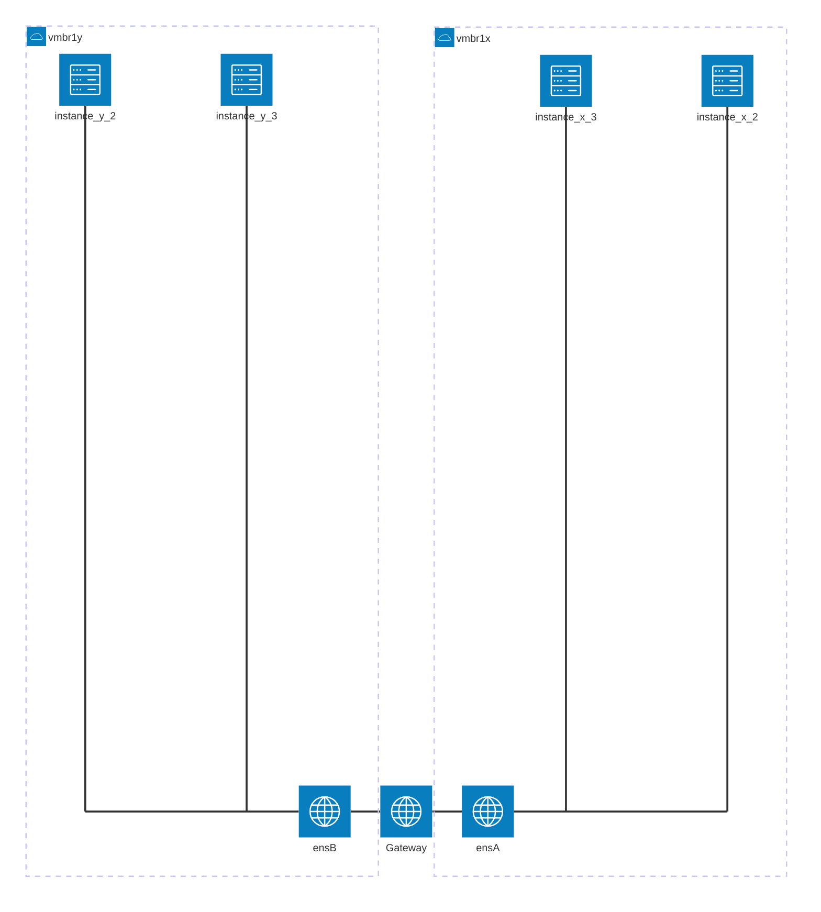

# TP1 - Virtualisation : Proxmox, Linux & Networking

_Sébastien Mériot_ ([@smeriot](https://bsky.app/profile/smeriot.bsky.social))

Durée: 3 heures

Introduction
=====================

Dans les architectures modernes, la virtualisation occupe une place prépondérante afin de pouvoir
utiliser au mieux la puissance des machines (comprendre, maximiser l'utilisation du CPU et de la
RAM afin de rationnaliser les coûts de consommation).

La virtualisation apporte également un avantage de flexibilité considérable puisqu'il est possible
de créer et de supprimer des machines virtuelles facilement. Fonctionnalité souvent méconnue, les
hyperviseurs permettent également d'assurer des niveaux de service (SLA) en offrant la possibilité
de migrer les machines virtuelles à chaud, de façon transparente d'une machine hôte à une autre.

Dans ce TP, nous allons nous familiariser avec [KVM](https://fr.wikipedia.org/wiki/Kernel-based_Virtual_Machine) au travers de [Proxmox](https://www.proxmox.com/), des solutions opensource très utilisées. Notamment KVM est la solution de choix pour les différents fournisseurs de Cloud Public (AWS, OVHcloud, Digital Ocean, ...).

Disclaimer
=====================

Dans ce TP, vous allez partager une même instance Proxmox pour les différents groupes de TP. Cela vous permettra de voir qu'il est possible de travailler simultanément sur un même hôte physique.

Première connexion
=====================

A l'aide des identifiants communiqués en cours, connectez-vous sur l'interface de gestion de Proxmox.

L'interface se décompose en 3 parties :
- A gauche, vous avez la vue générale des serveurs hôtes et des machines virtuelles qui tournent.
- Le panneau centrale affiche les informations détaillées des éléments selectionnés au travers du panneau de gauche.
- En bas, vous avez les différents *logs*. Chaque action générera des traces avec des status d'avancement. Etant donné que vous partagez la même instance à plusieurs, vous verrez également les actions des autres équipes.

Sur le panneau de gauche, il est possible de changer la visualisation. Celle par défaut est assez naïve avec un arbre représentant un *Datacenter* composé des hôtes portant chacun des machines virtuelles. Vous pouvez changer la visualisation à l'aide de la liste déroulante juste au dessus en sélectionnant par exemple la *Folder View* qui présente les différentes éléments du *Datacenter* sous une forme plus pertinent (c'est un avis personnel bien évidemment).

Quelque soit la vue, vous devriez voir apparaître le seul et unique hôte de notre cluser nommé `proxmox1`. Cliquez sur cet élément. En cliquant sur l'onglet `Summary` du panneau central, vous verrez l'état de la machine hôte qui va venir accueillir vos différentes machines virtuelles.

1. Indiquez le nombre de coeurs et la quantité de RAM disponible.
2. Selon vous, en considérant des petits VM ayant 1 vCPU et 2 GB de RAM, combien de VM au plus est-il possible de faire tourner simultanément sur cet hôte ?


Création des utilisations
=====================

Une bonne pratique d'administration et de sécurité consiste à toujours utiliser des comptes utilisateur nominatifs. Cela permet notamment de mieux tracer les actions de chacun (auditabilité).

3. Pour créer des utilisateurs, il faut commencer par créer un groupe. En cliquant sur le *Datacenter*, puis sur l'onglet `Groups` du panneau central sous la rubrique `Permissions`, créer un nouveau groupe ayant pour nom `Groupe_X` où `X` est le numéro qui vous sera affecté par votre encadrant.

4. Vous pouvez à présent créer autant d'utilisateur que de personnes dans votre groupe dans cliquant sur l'onglet `Users`. Saisissez un nom d'utilisateur, un mot de passe et sélectionnez la méthode d'authentification PVE (Authentification Proxmox, à contratio de l'authentification [PAM](https://en.wikipedia.org/wiki/Pluggable_Authentication_Module)). Affectez à chaque utilisateur le nouveau nouvellement créé.

5. Les nouveaux comptes créés peuvent être directement utilisés. Néanmoins, vous devriez vous rendre compte en vous connectant que l'interface est bien vide... En effet, aucun privilége n'est donné par défaut aux nouveaux comptes/groupes. Allez à présent dans l'onglet `Permissions`, et ajoutez une nouvelle permission. Etant donné les besoins du TP, nous allons uniquement donné des droits de manipulation des VM pour le moment. Cliquez sur `Add`, puis `Group permissions`. Saississez le *Path* tel que `/`, sélectionnez votre groupe, puis le rôle `PVEVdmin` ce qui vous donnera les privilèges suffisants pour la suite du TP. Raffraichissez l'interface pour les utilisateurs connectés et constatez que vous avez des options supplémentaires à présent !

Création de votre première VM
=====================

Nous pouvons passer à la création de machines virtuelles. Dans un premier temps, nous allons adopter l'approche _basique_ qui consiste à créer une nouvelle machine virtuelle et d'installer un système d'exploitation avec une image d'installation.

> [!NOTE]
> Proxmox permet la gestion de machines virtuelles mais permet également la gestion de conteneurs LXC. Nous ne verrons pas cette fonctionnalité.

## Téléchargement de l'image

Dans le cadre de ce TP, nous allons utiliser des distributions [Linux Debian](https://www.debian.org/index.fr.html). Pour installer une _Debian_ sur notre disque virtuel, nous devons utiliser une image d'installation.

> [!NOTE]
> Etant donné qu'une seule image est suffisante pour tous les groupes, si cette opération a déjà été réalisée par un autre groupe, vous n'êtes pas obligés de le faire.

Dans l'interface de Promox, cliquez dans le menu de gauche sur l'item `local (proxmox1)`. L'écran central vous présentera les options de gestion du stockage pour l'hôte `proxmox1`. Vous pouvez voir plusieurs onglets permettant de gérer les backups, les disques des VM, ainsi que les images ISO. C'est ce dernier onglet qui va nous intéresser. En cliquant dessus, vous pouvez voir la liste des images ISO déjà téléchargées.

Si une image ISO satisfaisante est déjà présente, vous n'êtes pas obligés d'en télécharger une nouvelle. Sinon, vous pouvez utiliser le bouton upload pour envoyer votre ISO favorite sur le serveur. Le bouton (grisé) `Download from URL` est également disponible pour directement télécharger l'image depuis un lien.

Une image a déjà été téléchargées sur cet hôte Proxmox. L'image téléchargée est le [DVD d'installation Debian](https://www.debian.org/CD/http-ftp/#stable) et pourra être utilisé pour simuler un DVD inséré dans le lecteur DVD de la machine virtuelle. De ce fait, vous ne devriez pas avoir à télécharger de nouvelle image.

## Configuration

L'image étant disponible, vous pouvez commencer à créer votre machine virtuelle.

Cliquez sur le bouton bleu `Create VM` et remplissez les informations générales de façon à avoir un VM ID `x01` ou `x` est le numéro assigné par votre enseignant, et ayant pour nom `Debian-x` où `x`est encore une fois le numéro qui vous a été assigné.

Une fois complété, vous pouvez passer à la partie OS. C'est ici qu'il va falloir indiquer de monter l'image ISO sur le lecteur DVD. Puis continuez jusqu'à l'onglet `Disks`. Par défaut, 32GB de disque sont alloués ce qui est beaucoup. Vous pouvez largement réduire cette taille à 10GB. Par défaut ces disques sont créés au format _QEMU_ (`qcow2`) qui est un format très optimisé de disque virtuel. Vous pouvez néanmoins utiliser d'autres formats tels que les fameux `vmdk` de VMware.

Continuez la configuration afin de créer une machine virtuelle ayant 1 vCPU et 2 GB de RAM. Vous pouvez laisser la configuration réseau telle que proposée.

## Démarrage

La création de la machine virtuelle prend un petit peu de temps. Il s'agit de l'allocation de l'espace disque pour le disque virtuel. Vous pouvez suivre l'avancement dans le panneau du bas.

Une fois la machine virtuelle créée, démarrez-là. Vous pouvez ensuite vous rendre sur l'onglet `Console` afin de voir l'affichage de la VM. Notamment, vous devriez la voir démarrer sur le disque d'installation.

## Installation de l'OS

Suivez les différentes étapes pour installer l'OS. Il est recommandé d'installer la machine virtuelle sans interface graphique (après tout, à quoi sert une interface graphique sur un futur serveur ?).

Lorsqu'il vous sera posé des questions concernants le réseau, indiquez que vous ferez la configuration ultérieurement.

Après quelques minutes d'installation, vous devriez avoir une nouvelle installation Debian fraîchement installée et vous pouvez jouer avec.

## Play !

6. Ouvrez un shell et créez un fichier dans `/root` en décrivant comme vous faites.

Création de votre deuxième VM
=====================

Comme indiqué précédemment, dans le monde réel, les machines virtuelles ne sont pas déployées en installant systématique un nouvel OS à la main. Cela sera fastidieux et apporte assez peu de valeur.

En règle générale, il est d'usage d'utiliser des _templates_ pour déployer de nouvelles machines virtuelles. Ceux-ci permettent des déploiements rapides (pas d'installation d'OS) et de pouvoir pré-déployer des outils de façon standardisée. C'est ce que nous allons réalisé à présent.

> [!NOTE]
> Il est également possible pour les administrateurs systèmes les plus aguérris de créer des configurations dynamiques au travers de [_Cloud-Init_](https://pve.proxmox.com/wiki/Cloud-Init_Support). Ainsi, vous pouvez au moment de créer la machine virtuelle à partir d'un template, spécifier un `hostname`, une `IP`, des clefs SSH, ... en quelques clics pour que _Cloud-Init_ vienne configurer automatiquement votre VM et qu'elle soit prête à l'usage une fois disponible.

## Création d'un template

7. En faisant un clic droit sur le panneau de gauche sur le nom de la VM que vous venez de créer, cliquez sur `Convert to template`. Vous devriez avoir un message d'erreur vous indiquant qu'il est impossible de faire de cette VM un template car celle-ci est allumée. Selon vous, pourquoi ?

Eteignez la VM et procédez à la création du template. Vous pouvez observer qu'à présent, le template n'est plus considéré comme une VM et ne peut plus être démarré.

## Cloner un template

Faites à nouveau un clic-droit sur votre template et sélectionnez `Clone`. Vous devez alors saisir à nouveau un VM ID qui sera `x02` où x est votre numéro de groupe, et comme nom `instance-x-1` où x est encore une fois le numéro de groupe.

Le menu `mode` est important. Vous pouvez sélectionner 2 options:
- `full clone`: il s'agira d'une copie intégrale du template pour créer une nouvelle VM ;
- `linked clone`: il s'agira ici de s'appuyer sur les données du template et de n'écrire que les _différences_ entre le template initial et la nouvelle VM. Cette solution est souvent utile car elle optimise l'espace disque.

Nous allons utiliser cette dernière option dans le cas présent. Cliquez ensuite sur `Clone`.

Vous pouvez démarrer la VM et vérifier que le fichier précédemment créé est bien présent.

Configuration Réseau
=====================

Si vous vous connectez sur votre VM, vous devriez remarquer que vous n'avez pas accès à Internet.

8. Indiquez comment vous faites le test.

9. Si vous vous souvenez, nous avons volontairement passé l'étape de configuration du réseau. Par conséquent, vous ne devriez pas avoir d'interface réseau configuré. Vérifiez en tapant les commandes adaptées.

## Interfaces virtuelles

En univers virtualisé, votre machine hôte possède au moins une interface réseau physique. Pour le reste, il s'agit d'interfaces virtuelles. Néanmoins, bien que ce soit des interfaces virtuelles, la façon de faire du réseau reste la même et tous les concepts continuent de s'appliquer (par exemple, ARP fonctionne de la même façon).

Une machine virtuelle est par définition une machine dans une machine. L'isolation entre la machine virtuelle est la machine hôte est censée être assurée par l'hyperviseur ce qui conduit la machine virtuelle à n'avoir aucun accès aux ressources de la machine hôte par défaut et (presque) inversement. L'hyperviseur joue le rôle d'interface entre le monde virtuel et le monde physique.

Côté réseau, cela s'applique également. Une machine virtuelle n'utilisera pas directement une interface physique. Elle devra s'appuyer sur une interface virtuelle.

>[!NOTE]
>Si vous avez déjà utilisé `VirtualBox` ou `VMware Player/Workstation` ou d'autres hyperviseurs de type 2, vous avez déjà dû remarquer la création d'interface réseau afin de réaliser la connectivité réseau entre la VM et la machine hôte.

La question qui se pose, c'est comment avoir du réseau sur votre VM ?

## Bridge vs NAT : Un peu de théorie

Les notions de `bridge` (pont) et de `NAT` (_Network Address Translation_) sont récurrentes en virtualisation afin de pouvoir donner accès au réseau physique aux VMs ou bien pour créer un réseau permettant de connecter les VMs entre elles afin de les faire communiquer.

### Bridge

Traduit littéralement par _pont_, un `bridge` n'est ni plus ni moins qu'un équipement capable de connecter différents équipements sur un réseau. Par exemple, un `switch` se comporte comme un `bridge` et va opérer en couche 2 du modèle OSI.

Dans le cas de la virtualisation, des interfaces réseaux sont créées sur la machine hôte afin de permettre de créer un réseau sur lesquelles les VMs pourront être connectées. Certains hyperviseurs parlent alors de `vswitch` (_virtual switch_). Sous Proxmox, nous configurerons des `bridges` à cet effet. Il est alors possible d'assigner des IPs aux différentes VM, soit en réalisant de l'adressage statique, soit en utilisant DHCP. Il est également possible d'utiliser un serveur DHCP présent sur le réseau sur lequel est connecté l'hyperviseur afin que les VM soient considérées comme des machines à part entière du réseau.


Il est possible de créer autant de _bridges_ qu'on le souhaite.

### _Network Address Translation_

C'est une technique que vous avez peut-être déjà utilisé au travers de votre box internet pour exposer un port réseau. 

Il s'agit d'une opération de __routage__ afin de permettre de donner accès à un sous-réseau à un autre sous-réseau. En reprenant l'exemple de votre box internet, si vous souhaitez ouvrir l'accès à un serveur web hébergé chez vous, vous devez configurer votre box internet pour _router_ le trafic arrivant de l'extérieur à destination de votre serveur au travers de votre box. Vous mettez alors en place des règles _NAT_.


C'est également utilisé sur certains réseaux opérateurs, par exemple sur la téléphonie mobile. Plusieurs appareils mobiles vont de ce fait partager une et une seule IP. C'est une spécificité du _NAT_.

Dans le cas de la virtualisation, le mode _NAT_ permet de donner accès à la VM aux éléments du réseau en utilisant l'adresse IP de la machine hôte. Elle reste donc inaccessible (sauf configuration spécifique).

>[!NOTE]
>Dans Proxmox, le _NAT_ n'est pas quelque chose de natif.

## Connecter une VM à un réseau

### Création du _bridge_

Dans le panneau de gauche, cliquez sur `localnetwork` afin de pouvoir consulter les _bridges_ disponibles.

Par défaut, Proxmox met à disposition un bridge nommé `vmbr0`. La configuration y est basique et permet de connecter les VM à un réseau. Néanmoins, il ne faut pas espérer en faire grand chose... Les bridges sont configurés au niveau des machines hôtes. Dans le cas d'un cluster de machine, Proxmox permet une interconnexion des bridges mais nous ne détaillerons pas ce point.

Dans le panneau de gauche, cliquez sur la machine hôte puis rendez-vous dans l'onglet `Network`. Vous y trouverez alors davantage d'interfaces réseau.

10. Identifiez dans la liste quelle est l'interface physique de l'hôte. En vous appuyant sur [cette documentation](https://www.linuxtricks.fr/wiki/nomenclature-des-interfaces-reseau-sous-linux-enp0s3-wlo1), tentez d'expliquer son nom.

A présent, nous allons regarder la configuration de l'interface `vmbr0`. Il est possible que votre encadrant ait volontairement simplifié la configuration étant donné que vous vous situez dans un cas de figure où Proxmox est installé sur un serveur dédié d'un fournisseur de Cloud.

11. Décrivez la configuration que vous observez pour `vmbr0`.

Nous allons à présent créer un bridge pour connecter votre VM à un réseau. Cliquez sur le bouton `Create` puis `Linux Bridge`.

12. Configurez un nouveau `bridge` ayant pour nom `vmbr1x` où `x` représente votre numéro de groupe. Vous utiliserez uniquement un adressage IPv4 en utilisant des ranges de 4 IPs (à vous de trouver le masque) en utilisant la plage `10.0.X.0/Y`  où `X` est votre numéro de groupe et `Y` votre masque. À noter que dans le champ `IPv4`, Proxmox s'attend à avoir l'IP à assigner à l'hôte.

Lorsque vous avez terminé, cliquez sur le bouton `Apply configuration` ce qui entrainera un rechargement des interfaces réseau.

### Raccordement de la VM au bridge

A présent que votre `bridge` est créé, nous allons configurer votre VM pour pouvoir s'y connecter. Sélectionnez votre VM puis rendez-vous dans l'onglet `Hardware`. Double-cliquez alors sur la ligne `Network Device` afin d'avoir une popup qui s'ouvre permettant de modifier les informations. Changez le `bridge` afin d'utiliser celui créé précédemment.

>[!NOTE]
>Certains éléments de configuration des VM sont modifiables à chaud, mais ils sont minoritaires. Le réseau fait parti des configurations modifiables à chaud.

### Configuration de l'interface

Ouvrez la console de votre VM puis ouvrez un terminal de commande dans votre VM. 

13. Essayez de lancer un ping vers l'IP assignée à l'hôte configurée précédemment. Est-ce que cela fonctionne ? Pourquoi ?

La commande `ip a` vous permettra de lister les interfaces réseau. Vous devriez en voir 2:
- `lo`
- `ensXX` où `XX` représente un nombre entre 0 et 99 comme détaillé [ici](https://www.linuxtricks.fr/wiki/nomenclature-des-interfaces-reseau-sous-linux-enp0s3-wlo1)

14. A quoi correspond l'interface `lo` ?

Le meilleur moyen de configurer une interface réseau est de s'appuyer sur le fichier de configuration  `/etc/network/interfaces`. Nous allons configurer l'interface `ensXX` afin qu'elle puisse obtenir une IP sur le réseau et pouvoir dialoguer avec la machine hôte. En effet, cela ne vous aura pas échappé qu'aucun service DHCP n'est disponible sur notre réseau pour venir attribuer automatiquement un bail à notre machine.

La syntaxe utilisée par le service `networking` Linux est relativement simple et intuitive. En cas de besoin, la [manpage](https://manpages.debian.org/stretch/ifupdown/interfaces.5.en.html) peut vous être utile.

>[!IMPORTANT]
>Dès lors que `ensXX` sera mentionné, veillez à utiliser le véritable nom de votre interface tel que listé via la commande `ip a`. Exemple: `ens18`

A la fin du fichier, nous allons commencer par indiquer que l'interface `ensXX` doit être démarré automatiquement lors de l'activation du réseau sur la machine. Cela se traduit par la ligne:
```
auto ensXX
```

Puis juste après, configurez l'interface afin de définir une _adresse IPv4 statique_ et une _gateway_.

Lorsque votre configuration est terminée, redémarrez le service `networking` avec la commande suivante:
`sudo service networking restart`

En cas d'erreur, vous pouvez consulter les logs systèmes à l'aide de la commande `journalctl -xe` afin de tenter de débuguer votre configuration.

15. Détaillez la configuration que vous avez écrite.


### Tester la connectivité

Il est venue l'heure de vérité. Vérifiez que la commande `ip a` retourne les informations que vous avez configuré dans le fichier `interfaces`. Vous pouvez également consulter que la _gateway_ est correctement configurée à l'aide de la commande `ip route`.

Si la configuration vous semble bonne, vous pouvez alors lancer la commande `ping` en spécifiant comme destination l'IP de la machine hôte.

## Faire communiquer 2 VMs entre elles

### Création d'une nouvelle VM

A l'aide de la technique vue précédemment permettant la création d'une VM en utilisant un template, créez une seconde VM. Vous devez alors saisir à nouveau un VM ID qui sera `x03` où x est votre numéro de groupe, et comme nom `instance-x-3` où x est encore une fois le numéro de groupe.

Configurez le hardware de cette VM afin de la connecter sur le bon `bridge`.

>[!WARNING]
>Veillez à ce que les adresses MAC soient différentes entre les 2 VMs.

16. Que pourrait-il se passer si l'adresse MAC était similaire ?

### Configuration de l'interface réseau

Comme vu précédemment, configurez l'interface réseau de cette nouvelle VM via le fichier de configuration `/etc/network/interfaces` en lui assignant une _IPv4 statique_ ainsi qu'une _gateway_.

Relancez le service `networking` et essayez de faire communiquer vos 2 VMs.

17. Quel est l'intérêt selon vous que l'hôte puisse être contacté par les VMs ?


Routage entre différents réseaux
=====================

A présent que vous avez mis en place votre propre routage, rapprochez vous des autres groupes afin de pouvoir contacter leurs VMs.

Actuellement, vous avez une architecture qui ressemble à ceci:


L'objectif de cette partie est d'arriver sur une cible telle que:


## Retrait de l'hôte

Comme vous l'avez peut être identifié, l'hote n'a que peu de valeur à être dans votre _bridge_ étant donné que celui-ci n'a pas vocation à interragir directement avec les VMs.

De ce fait, éditez la configuration des _bridges_ des réseaux à interconnecter afin de retirer l'IP assignée à la machine hôte.

18. Tentez de ping à nouveau la machine hôte sur chaque réseau. Est-ce que cela fonctionne ? Pourquoi ?

## Création d'une nouvelle VM

Nous allons réaliser le routage au travers d'une _gateway_ Linux. Pour ce faire, une machine va être nécessaire qui aura le rôle de routeur entre les deux réseaux.

A l'aide la technique vue précédemment, créez une nouvelle machine virtuelle à l'aide du template à laquelle vous donnerez l'id `9xy` où `x` et `y` représentent les 2 numéros de groupes, et avec pour nom `gw-x-y` avec la encore `x` et `y` étant les 2 numéros de groupe. 

Etant donné que cette VM aura un rôle de routage, vous devrez ajouter dans la configuration de la VM deux cartes réseau branchées sur les 2 réseaux _bridges_ à interconnecter.

## Configuration des interfaces

Lancez la machine, ouvrez une console puis un terminal. A l'aide de la commande `ip a`, assurez-vous que vous avez bien 2 interfacesréseau.

19. Comment pouvez-vous savoir quelle interface correspond à quelle _bridge_ ?

A l'aide du fichier `/etc/network/interfaces`, configurez une IP sur les 2 interfaces. Il est recommandé d'utiliser l'IP `a.b.c.1` pour plus de facilité. Configurez la _gateway_ comme étant vous-même. Enfin redémarrez le service `networking` et essayez de contacter les VMs sur les différents sous-réseaux. Si tout est en ordre, cela devrait fonctionner.

A l'inverse, essayez de ping depuis les VM la nouvelle machine installée, cela devrait également fonctionner.

A présent, depuis une VM pré-existante, essayez de lancer un ping à destination d'une VM d'un autre bridge. Cela devrait se traduire par un échec.

20. Lancez `tcpdump` sur la _gateway_ afin de capturer les paquets de l'interface connectée au même _bridge_ que la VM avec laquelle vous tentez d'envoyer des ping. Relancez les ping et analysez la capture réseau. Qu'en déduisez-vous ?

## Routage

Afin que les paquets soient correctement routés vers le bon paquet, il est nécessaire de configurer plusieurs éléments.

### Route

Le premier élément est d'indiquer aux différentes machines quelle est la route à suivre. Nous sommes dans un cas simple ici et - théoriquement - la configuration devrait déjà être correcte sur les différentes VM. Pour vous en assurer, lancez la commande `ip route`. Vous devriez avoir votre _gateway_ indiquée comme la route par défaut:

```
# ip route
default via 10.0.x.1 dev ensA onlink
```

Cela indique que pour contacter n'importe quelle IP n'appartenant pas au même sous-réseau, le système va tenter d'acheminer les paquets en s'adressant à `10.0.x.1`. C'est le comportement que vous devriez observer dans le `tcpdump`.

### Activation du _forward_

Par défaut, la fonctionnalité de transférer des paquets d'un réseau à un autre est désactivé sous Linux. Il faut donc l'activer manuellement sur la _gateway_.

Editez le fichier `/etc/sysctl.conf` et recherchez la ligne `#net.ipv4.ip_forward=1` afin de la décommenter. Sauvegardez le fichier puis recharger la configuration à l'aide de la commande `sysctl -p`.

21. Relancez le `tcpdump` sur la _gateway_ et retentez à présent de faire un ping depuis une VM vers une VM d'un autre _bridge_. Que constatez-vous ?
