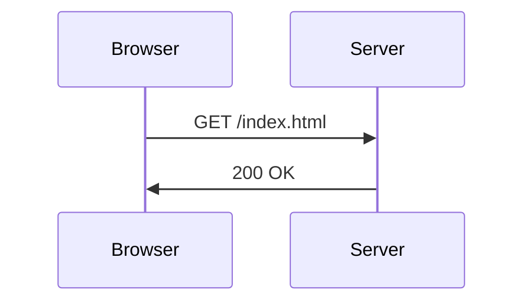
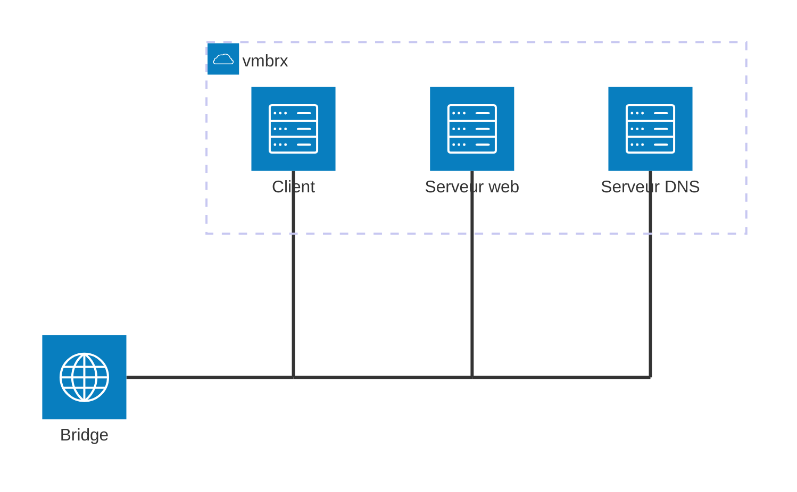

# TP2 - Protocoles : ARP, TCP, HTTP & friends

_Sébastien Mériot_ ([@smeriot](https://bsky.app/profile/smeriot.bsky.social))

Durée : 2 heures

Introduction
===========

Lors du précédent TP, vous avez appris à manipuler [Proxmox](https://www.proxmox.com/), un hyperviseur de type 1.
Vous savez créer des VMs ainsi que des réseaux à l'aide de _bridge_. Vous avez également pu voir comment faire
du routage système via Linux.

A présent que vous savez monter un environnement, nous allons pouvoir en profiter pour que vous montiez votre
propre environnement afin de pouvoir réaliser le TP qui consistera à analyser les différents protocoles qui
sont mis en jeu lorsque nous faisons une banale requête `HTTP`.

Quelques rappels utiles
=======================

Sans faire de rappel sur les couches OSI, il est bon de se remémorer que le réseau permet à la fois de faire transiter des informations bas niveau (couche Réseau) et haut niveau (couche Présentation ou Application).

Dans la grande majorité des cas, nous observons que les protocoles réseau intervenants en couches hautes s'appuient sur des protocoles réseau de plus bas niveau. `HTTP` est un excellent exemple qui répond à cette règle.

## C'est quoi HTTP ?

`HTTP` ou `HyperText Transfer Protocol` est un protocole de type texte - c'est-à-dire humainement compréhensible à l'inverse des protocoles binaires - permettant d'interroger des pages web et de transmettre des données. Ce protocole n'est pas nouveau puisqu'il a vu le jour au début des années 90.

Ce protocole va s'appuyer sur un système de requête/réponse. Le client envoie des requêtes et le serveur répond en fonction. Le client aura ainsi la possibilité d'envoyer différents types de requête en fonction de l'action à opérer.

Ces requêtes et ces réponses possèdent toutes des _entêtes_ (_headers_) et un _corps_ (_body_). 

Par exemple, pour récupérer le contenu de la page `index.html`, le client pourra émettre une requête de type `GET` comme ceci:



Le serveur répond alors par un code de retour avec, dans le corps de la réponse, le contenu de la page. Le code de retour sera dépendant de la bonne interprétation de la requête. Le code sans doute le plus connu est le fameux `404` indiquant que la ressource n'a pu être trouvée. Mais il en existe bien d'autres (`500 Internal Server Error`, `401 Forbidden`, ...).

## Quel lien avec les couches du modèle OSI ?

Comme beaucoup d'autres protocoles, `HTTP` s'appuie sur `TCP` ce qui signifie qu'une requête `HTTP` n'est rien d'autre qu'un paquet `TCP` (qui est lui-même un paquet `IP`, ...).

Cela signifie que lorsque nous ferons l'analyse réseau, nous pourrons avoir plusieurs niveaux de lectures des paquets que nous verrons être échangés :
- interpréter ces paquets comme des paquets `TCP` ayant un contenu particulier ;
- interpréter ces paquets comme étant des paquets `HTTP` en omettant les caractéristiques de TCP.

Mise en place de l'environnement
================================

Dans le cadre du TP, nous allons utiliser 3 machines virtuelles _Debian_ afin d'avoir une architecture de la
sorte:



Concrètement, il vous faut:
- Créer 3 machines virtuelles _Debian_ en adoptant la convention suivante (`x` représentant votre numéro de groupe):
  - `client-x` ayant pour id `x01`
  - `web-x` ayant pour id `x02`
  - `dns-x` ayant pour id `x03`
- Créer un _bridge_ `vmbrx` afin de connecter les 3 machines sur le même réseau.
- Utiliser comme plan d'adressage `10.x.0.0/28` (et rappelez combien d'IP sont à votre disposition)

Deux images sont à votre disposition pour en faire des _clones_ :
- `debian-vanilla` pour les machines `client-x` et `web-x`
- `debian-dns` pour la machine `dns-x`

Mise en place d'un serveur web
==============================

La grande majorité des applications aujourd'hui sont des applications web. Cela s'oppose aux _applications lourds_
aussi nommées _clients riches_ qui étaient prédominantes il y a encore 15 ans. L'avantage des applications web
est la facilité de déploiement et de mise à jour étant donné qu'un navigateur suffit pour y accéder, là où les
_applications lourdes_ nécessitaient des déploiements d'entreprise importants.

Ces applications web reposent sur le fait d'utiliser le protocole _HTTP_ (en vrai, il s'agit plutôt de _HTTPS_ qui
est la version sécurisée de _HTTP_, vous le verrez en cours de _Sécurité Réseau_). Dans ce TP, nous souhaitons
avant tout faire de l'analyse réseau, nous n'allons pas déployer de gros serveur web inutile. Nous allons plutôt
utiliser le serveur web du pauvre: le module `http.server` de _Python_. Bien évidemment, ceci n'est pas à
reproduire sur des environnements de production, nous sommes dans un cadre exploratoire.

## Création d'un fichier HTML

Qui dit serveur web, dit quelques fichiers HTML à servir... Pour ce faire, commencez par créer un répertoire `web`.
Puis créez un fichier `index.html` dans lequel vous pouvez mettre le strict minimum (`Hello World` étant tout à
fait acceptable dans le cadre de ce TP).

## Lancement du serveur web

Positionnez-vous dans le dossier `web` puis lancez la commande suivante:
```
python3 -m http.server 80
```

Cette commande vise lancer le module `http.server` de _Python_ en écoutant sur le port 80.

1. Une erreur devrait se produire. Pourquoi selon vous ?

Retentez à présent avec la commande suivante:
```
sudo python3 -m http.server 80
```

2. Pourquoi est-ce que cela fonctionne cette fois-ci ?

Vous avez donc un serveur web fonctionnel qui tourne.

Test du serveur web
===================

Pour tester un serveur web, nous devons envoyer des requêtes HTTP. Il existe tout un tas de stratégie mais nous
allons opter pour la plus courante : `curl`. Cet utilitaire en ligne de commande permet d'envoyer des requêtes HTTP
et permet de faire un très grand nombre d'opérations du quotidien.

## Installation de `curl`

`curl` est rarement installé par défaut sur les distributions Linux. Pour en avoir le coeur net, vous pouvez lancer la commande `curl` toute seule ce qui devrait vous retourner un attendu `Command not found`.

Nous allons donc devoir l'installer. Mais... comment faire étant donné que vous n'avez pas de réseau ?

Lors du TP précédent, vous avez installé vos VM à l'aide un DVD d'installation. Ce DVD va faire office de dépôt
de paquets !

Assurez vous que l'ISO du DVD est bien montée dans la configuration hardware de la VM _client_. Puis, en user
`root`, lancez la commande `lsblk` qui vous listera les périphériques de stockage détectés par le système.

```
# lsblk
NAME          MAJ:MIN RM  SIZE RO TYPE  MOUNTPOINTS
sda             8:0    0  10G   0 disk
├─sda1          8:1    0  9G    0 part  /
├─sda2          8:2    0  1K    0 part  
└─sda5          8:5    0  975M  0 part  [SWAP]
sr0            11:0    1  3.7G  0 rom   
```

Vous devriez observer comme l'exemple ci-dessus, un périphérique `sr0` supportant un périphérique de type `rom`.

Fort de ce constat, il est possible d'indiquer à notre gestionnaire de paquets `apt` que nous allons utiliser
ce DVD comme source pour installer de nouveaux paquets à l'aide de la commande:
```
# apt-cdrom add sr0
Utilisation du point de montage /media/cdrom pour le cédérom
Identification...
```

A présent, il est possible de passer à l'installation de `curl`.

## Installation et test de `curl`

Pour installer `curl`, rien de plus simple:
```
# apt install curl
```

Une fois le processus terminé, vous pourrez alors utiliser la commande `curl`. Pour interroger votre site web tout
en affichant la réponse totale du serveur distant (_entête_ et _corps_), il vous suffira de lancer la commande
suivante:
```
$ curl -i <ip_de_votre_site>
```

Mise en place d'un serveur DNS
==============================

## Rappels sur DNS

Avant de rentrer dans le vif du sujet, quelques rappels théoriques s'imposent.

DNS signifie _Domain Name Service_, ce qui peut se traduire en français par _Service de Nom de Domaine_.

### C'est quoi un nom de domaine ?

Si vous étiez interrogés pour donner des noms de domaine que vous connaissiez, vous sauriez très certainement
en citer des centaines. Et c'est là tout l'intérêt d'un nom de domaine : être en capacité de mémoriser facilement
une adresse car, convenons-en, il est plus simple de mémoriser un nom de domaine qu'une IP par exemple.

Concrètement, un nom de domaine va se décomposer en 2 éléments principaux. Prenons `example.com` :
- le _TLD_ (_Top Level Domain_ ou _Domaine de Premier Niveau_), ici `com` est le "suffixe" des noms de domaine.
Ce _TLD_ est géré par différents registres auxquels vous versez une redevance lorsque vous achetez un nom de
domaine. Cette redevance est fixée par le registre est vise, entre autre, à couvrir les frais d'explotiation. Dans
le cas du `.fr` par exemple, il s'agit de l'[AFNIC](https://www.afnic.fr/) qui gère ce _TLD_.
- le nom de domaine, ici `example`

Un nom de domaine peut également posséder un _sous-domaine_. Par exemple `sub.exemple.com`. A noter qu'il est possible de faire autant de sous-domaines qu'on le souhaite.

Dans le cas le plus connu, l'utilisation sera d'associer une IP à un nom de domaine grâce à la notion de __DNS__.

### _Domain Name Service_

_DNS_ est à la fois un service permettant l'association d'information à un nom de domaine, et c'est également un
protocole réseau.

D'un point de vue service, _DNS_ est le plus connu pour associer une IP à un nom de domaine. Mais il a la capacité
de faire bien plus en associant également un serveur mail pour indiquer quel est le serveur mail associé au nom
de domaine, des méta données textuelles, etc... Dans ces différents cas, des _champs_ sont utilisés. Il existe
plusieurs types de _champs_ :
- `A` : pour l'association d'une IPv4 au domaine
- `AAAA` : pour l'association d'une IPv6 au domaine
- `MX` : pour le serveur mail à contacter dans le cadre d'envoi de mails sur le domaine
- `TXT` : pour des champs textuels de méta-données
- ...

Il est dit que ces champs réprésentent la configuration _DNS_ du domaine, cette même configuration était présente
dans la configuration de la _zone DNS_.

C'est également _DNS_ qui permet la configuration du _reverse_ d'une IP via le champ _PTR_.

Enfin comme indiqué, _DNS_ est un protocole basé sur _UDP_ (avec un support de _TCP_) de type binaire.

## Configuration de la zone DNS

L'image `debian-dns` est préconfiguré avec un service DNS installé par défaut (`bind9`). 
Afin de gagner du temps, le service a été configure afin de fournir des logs dans le dossier
`/var/log/named/` et possède une configuration prête à l'emploi. Nous allons faire en sorte
que le nom de domaine `website.int` résolve l'IP qui vous avez assigné au serveur web.

Afin de réaliser cette opération, vous allez devoir modifier le fichier
`/etc/bind/named.conf.local`.

Nous allons commencer par déclarer une nouvelle zone _DNS_ en y ajoutant les lignes suivantes:
```
zone "website.int" {
    type master;
    file "/etc/bind/website.int";
}
```

Puis, nous allons créer le fichier `/etc/bind/website.int` en copiant `db.local` afin d'avoir
un exemple. Ouvrez `/etc/bind/website.int`.

3. Tous les noms de domaine possèdent des entrées _DNS_ `SOA` et `NS`. Expliquez de quoi il
s'agit ?

Nous allons commencer par modifier l'entrée _SOA_ pour s'adapter à notre cas de figure. Il s'agira uniquement de remplacer `localhost.` par `ns.website.int.` (le serveur _DNS_ autoritaire)
puis `root.localhost.` par `root.website.int.`

Enfin, il s'agit de remplacer l'entrée _NS_ par `ns.website.int.`.

>[!NOTE]
>Il est recommandé de modifier le `@` signifiant _la racine du domaine_, à savoir dans notre cas `website.int` en spécifiant directement `website.int.` (sans oublier le point à la fin) pour éviter d'éventuelles confusions.

Ces deux premiers enregistrements DNS sont obligatoires. Nous pouvons ensuite passer à la
configuration de notre zone :
- Ajouter un champ A permettant de faire pointer `website.int` vers l'IP du serveur web ;
- Ajouter le sous-domaine `ns` afin d'indiquer que le résolveur DNS et le serveur DNS.

Vous pouvez vérifier la configuration à l'aide de la commande `named-checkzone website.int /etc/bind/website.int` afin de voir si des erreurs sont identifiées. De même en regardant les
logs.

Pour recharger la configuration, vous pouvez alors exécuter la commande:
```
service bind9 reload
```

Pour tester sur le serveur DNS si votre configuration est la bonne, vous pouvez utiliser
la commande `host` ou la commande `dig` :
```
host website.int
dig A website.int @127.0.0.1
```

Ces commandes devraient vous donner l'IP configurées dans votre zone DNS.

## Utilisation d'un resolveur DNS

Un serveur DNS c'est bien, mais c'est mieux qu'il soit ensuite utilisé par les machines de
votre réseau. Sur la machine `client`, essayez de lancer la commande `host website.int`
pour voir ce qu'il se passe.

4. Pourquoi avez-vous une telle erreur ?

Installez sur la machine le paquet `resolvconf` afin de pouvoir configurer un serveur DNS
sur votre machine. Puis ajouter dans votre configuration réseau sur votre interface la
ligne magique:
`dns-nameserver X` où `X` représente l'IP de votre serveur DNS.

Tentez à nouveau la résolution _DNS_ pour vous assurer que ça fonctionne.

Analyse des flux
================

Nous allons à présent faire une capture réseau à l'aide de `tcpdump` sur la machine `client`.
Installez le paquet si ce n'est pas déjà fait.

>[!NOTE]
>`tcpdump` permet de capturer des paquets, soit en live, soit dans un fichier au format `pcap`
à l'image de _Wireshark_.

Notre objectif est de faire une capture des intéractions réseaux lors d'une requête HTTP
envoyée au serveur `webserver`. Pour ce faire, nous allons lancer `tcpdump` de façon à 
enregistrer les paquets réseaux dans un fichier sur le disque afin de l'analyser à posteriori:
```
tcpdump -n -w capture.pcap &
```

5. Pourquoi ajouter le `&` à la fin de la commande ?

A présent, en utilisant la commande `curl`, envoyez une requête _HTTP_ en utilisant le nom
de domaine `website.int`.

Une fois la commande réussie, vous pouvez interrompre la capture réseau à l'aide de la
commande `fg` pour retrouver le process `tcpdump` puis en appuyant sur `CTRL+C`.

6. Combien de paquets ont été enregistrés ? Quelle est la taille du fichier `capture.pcap` ?

Pour lire le fichier pcap, vous pouvez également utiliser `tcpdump` de la sorte:
```bash
# Version simplifiée
tcpdump -r capture.pcap
# Version complète
tcpdump -X -r capture.pcap | less
```

7. Faites un diagramme de séquence des différentes intéractions qui ont eu lieu pour aboutir
à la requête _HTTP_.

Nettoyage
=========

Pour terminer ce TP:
- supprimez les machines virtuelles créées
- supprimez les _bridges_ créés
