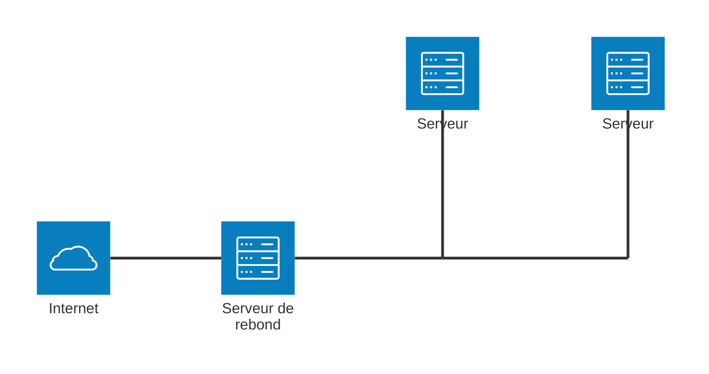
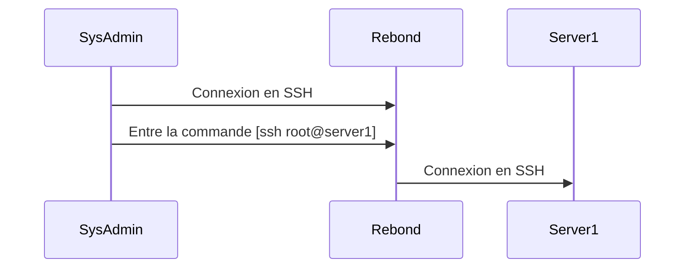
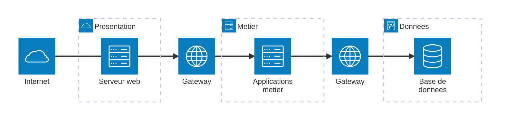

# Project - My Little Bank

_Sébastien Mériot_ ([@smeriot](https://bsky.app/profile/smeriot.bsky.social))

Durée: 16 hours

# Introduction

Ce projet consiste à implémenter un bout de SI bancaire _simpliste_ dans sa globalité :
infrastructure, réseau et applicatifs. L'objectif est bien de mettre en oeuvre une infrastructure et son réseau et non de rentrer dans le détail de [CORE](https://www.stet.eu/assets/files/Documentation-FR/core-elements-corefr-internet.pdf). Nous ferons volontairement dans la simplicité en reprenant quelques concepts de base.

Ce projet est à réaliser en groupe de 5 à 6 étudiants et sera évalué par l'intermédiaire d'un
robot qui vérifiera :
1. Le respect des API (`swagger`) (en cas de non-respect, le robot ne fonctionnera pas)
2. Le respect des formats de fichier (en cas de non-respect, le robot ne fonctionnera pas)
3. La bonne implémentation et le bon traitement des données
4. Le respect des contraintes d'architecture en auditant les réseaux

>[!NOTE]
>Vous pourrez déclencher l'exécution du robot sur les points 1 et 2 afin de vous assurer de respecter correctement le contrat.

Ce projet devra être réalisé via différentes machines virtuelles et réseaux configurés dans
un environnement _Proxmox_.

# Spécifications à respecter
<a name="spec"></a>

## Description générale

À l'image d'un vrai SI bancaire, ce projet devra exposer 1 API publique à destination des
clients, 1 API privées à destination des autres banques et devra pouvoir consommer des
fichiers contenant des transactions (virements, chèques, ...) via des fichiers qui seront
déposés via un serveur FTP par les autres organismes bancaires.

Toutes ces informations seront traités par un _backend_ non exposé sur Internet qui sera
le seul à avoir accès à la sainte base de données (elle-même sur un réseau déconnecté
d'Internet).

Afin de pouvoir administrer les différentes machines, un réseau d'administration sera mis en
oeuvre permettant de se connecter en SSH sur les différentes machines à l'aide d'une
_machine de rebond_.

Toutes les machines devront être identifiées de façon claire et ordonnée dans Proxmox et
être configurée avec un `hostname` cohérent. De même, toutes les machines devront avoir un
compte `debian` avec pour mot de passe `debian` afin de permettre l'audit de l'infrastructure.

A présent, nous allons entrer dans le détail de chaque aspect.

## Réseau d'administration

Etant donné que certaines des machines de l'infrastructure n'auront aucun accès à Internet,
il ne sera pas possible de se connecter en SSH directement à celles-ci pour opérer les
tâches d'administration usuelle.

En règle générale, un réseau d'administration (réseau de management) est mis en oeuvre. Ce
réseau permet de se connecter à toutes les machines de l'infrastructure dans le cadre des
opérations d'administration.
Le réseau d'administration peut également être utilisé dans le cadre du déploiement continu.

Dans le cadre de ce projet, un réseau similaire sera mis en oeuvre permettant d'accéder en
SSH à l'intégralité des machines de l'infra. Voici un exemple de ce à quoi ce type de
réseau doit ressembler:



Le réseau d'administration est généralement composé d'un serveur de rebond qui permet ensuite
de contacter les autres machines. Nous allons rester dans un cas simple qui est le suivant:



>[!NOTE]
>On note que le serveur de rebond possède 2 interfaces réseau: une interface publique sur Internet et une interface privée sur le réseau d'administration.

## Architecture en tier

Les architectures modernes utilisent la notion d'architecture en tier. Cette architecture
apporte un découpage de l'infrastructure qui la rend plus facilement modulaire et
administrable. Cette architecture est également très intéressante sur un plan de sécurité
puisqu'elle permet - par exemple - d'isoler la base de données dans _un réseau de confiance_.

Concrètement, une architecture en tier s'organise en couches. Chaque couche a une
responsabilité unique. Les couches précédentes peuvent s'appuyer sur les suivantes mais pas
l'inverse. Chaque couche possède son propre sous-réseau et les échanges entre couches sont
réalisés à l'aide de _gateway_. Voici un exemple généraliste :


Ainsi la base de données n'est pas autorisée à être contactée directement par le serveur web
exposé sur Internet ce qui réduit les risques en cas de compromission du serveur web. En
effet, il est d'usage de considérer que les serveurs directement exposés sur Internet (nommés
généralement __serveurs frontaux__) sont la porte d'entrée des menaces informatiques.

## Les _serveurs frontaux_

Dans notre architecture, nous aurons 1 _serveur frontal_ directement accessible depuis
Internet portant l'API publique et, cas particulier, 2 _serveurs frontaux_ accessibles depuis
un réseau privé _interbancaire_ non exposé sur Internet, mais exposé auprès des autres
instituts bancaires. Ces derniers étant exposés à des entités inconnues, nous appliquerons
les mêmes mesures de sécurité que s'il s'agissait d'une exposition sur Internet.

### FTP

Un serveur FTP sera accessible sur le réseau _interbancaire_ afin de permettre aux autres
organismes bancaires de partager des fichiers textes contenant des transactions à intégrer.
Historiquement, ces fichiers contiennent les ordres de virement, les prélèvements ou bien  les
 encaissements de chèque.

Pour les besoins du TP, ce serveur FTP sera configuré de façon à accepter des connexions
entrantes pour l'utilisateur ___bank___ avec le mot de passe ___MyLittleBank___.

>[!NOTE]
>Ce mot de passe n'est en effet pas très sécurisé, tout comme l'utilisation du protocole
FTP. La réalité impliquerait des mesures de sécurité bien supérieures.

A la connexion, le serveur FTP doit présenter 2 dossiers dans lequel l'utilisateur ___bank___
doit pouvoir lire et écrire des fichiers :
- `in` : l'utilisateur y déposera les fichiers à intégrer par notre banque
- `out` : les fichiers produits par notre banque à destination de la banque ___bank___

Le format des fichiers reçus et produits est comme suit et est toujours construit de la même
façon:
- `FROM`: indiquant le compte débiteur
- `DEST`: indiquant le compte créditeur
- `AMOUNT`: indiquant la somme
- `CURRENCY`: indiquant la devise utilisée
- `LABEL`: le libellé de la transaction

Voici un exemple:
```
FROM:901122
DEST:781338
AMOUNT:64.41
CURRENCY:EUR
LABEL:VIREMENT MAMAN
```

Il n'y a qu'une seule transaction par fichier. Pour simplifier les choses, il est considéré
que les fichiers déposés sont toujours corrects et au format attendu.

### API privée

L'API privée sera également accessible depuis le réseau _interbancaire_ afin de permettre aux
autres organismes bancaires d'effectuer des opérations _instantanées_.

Un [swagger](https://raw.githubusercontent.com/PandiPanda69/edu-isen-tp-network/refs/heads/main/samples/private-api-swagger.yaml) est à votre disposition afin d'avoir le contrat des
différents endpoint, _Swagger_ étant un langage de description d'API. Vous pouvez par exemple
utiliser [l'éditeur en ligne](https://editor.swagger.io/) pour lire le fichier (Menu `File`
puis `Import URL`). L'outil vous présentera les différentes routes avec les paramètres
attendus et les retours attendus. Vous pouvez également faire de la génération de code à
partir du _Swagger_ (attention, le résultat n'est pas toujours au rendez-vous...).

Comme indiqué précédemment, __cette API n'a pas le droit d'interroger directement la base
de données__ puisque cette API se situe dans un réseau qui n'est pas de confiance.

Encore une fois, pour simplifier les choses, aucune authentification ne sera requise.

De même, comme vous pouvez le voir, les endpoints concernant les devises (`/currency`) ne
sont pas obligatoires et peuvent retourner le code `501 - Not Implemented Yet` pour indiquer
que vous n'avez pas eu le temps de les réaliser. Il s'agit uniquement d'un bonus.

### API publique

L'API publique sera acessible directement depuis Internet et permettra notamment aux clients
de consulter les informations de leur compte bancaire.

Tout comme l'API privée, un [swagger](https://raw.githubusercontent.com/PandiPanda69/edu-isen-tp-network/refs/heads/main/samples/public-api-swagger.yaml) est disponible afin d'avoir le 
contrat des différents endpoints attendus. Là encore, vous pouvez utiliser 
[l'éditeur en ligne](https://editor.swagger.io/) pour lire le fichier (Menu `File` puis 
`Import URL`).

Comme indiqué précédemment, __cette API n'a pas le droit d'interroger directement la base
de données__ puisque cette API se situe dans un réseau qui n'est pas de confiance.

Encore une fois, pour simplifier les choses, aucune authentification ne sera requise.

# Règles métiers

Afin de compléter les spécifications, voici quelques règles métier permettant de guider
l'écriture du mini système d'information:
1. les fichiers déposés sur le FTP doivent être intégrés au maximum au bout de 2min.
2. un numéro de compte est un nombre à 6 chiffres (entre 100000 et 999999).
3. le premier chiffre du numéro de compte indique la banque. De ce fait dans notre cas, le premier chiffre doit toujours être identique pour les comptes détenus dans la banque.
4. lorsqu'un client souhaite visualiser le détail de son compte, les 50 dernières transactions lui sont affichées.
5. il est impossible de réaliser une transaction si les fonds sont insuffisants. La seule exception concerne les fichiers transmis sur le FTP qui peuvent mettre le compte __à découvert__.
6. en cas de découvert, des frais bancaires de 50 en devise du compte sont appliqués à chaque transaction.
7. lorque qu'un virement est créé par un de vos clients à un autre de vos clients, la transaction est exécutée immédiatement sans passer par un fichier.
8. si un virement est créé par un de vos clients à destination d'une autre banque, un fichier de transaction est créé dans le dossier `out`.
9. par défaut, la seule devise que vous devez gérer est l'euro (`EUR`).
10. si vous avez le temps et l'envie, vous pouvez gérer d'autres devises. Dans ce cas, les taux de conversion vous seront transmis au travers de l'API privée.

# Accès à Internet
<a id="internet"></a>

Certaines de vos VMs vont nécessiter un accès à Internet que ce soit pour installer des
paquets ou encore parceque ce sont des serveurs frontaux (API publique, serveur de rebond,
...).

Lors de votre phase de conception, il vous sera demandé de spécifier le `bridge` qui
représentera le _réseau Internet_. Faites alors __valider par votre encadrant__ afin
que celui-ci configure les règles _NAT_ permettant de vous ouvrir les bons flux.

# Aide

Il est possible que ce projet soit un gros challenge pour vous si jamais vous n'aviez jamais
réalisé d'API auparavant, d'intéraction avec une base de données ou bien d'infrastructure.

Pas de panique, voici un peu d'aide !

## Une conception simple

Afin de garder la tête froide, rien ne vaut une conception simple qui répond aux critères
demandés. Ne venez pas rajouter de surplus si vous n'êtes pas en confiance avec ce que
vous êtes en train de réaliser !

## Comment réaliser une API ?

Il est possible que vous n'ayez jamais eu à réaliser d'API auparavant. Si tel est le cas,
il existe des _frameworks_ faciles à appréhender qui vous permettront de rapidement
produire une API sans effort. Voici quelques recommandations mais vous êtes bien
évidemment libre de choisir ce qui vous semble le plus adapté :
- `Flask` si vous êtes un adapte de _Python_
- `Gin` ou bien l'utilisation de `net/http` pour les adeptes de _Go_

Ces deux recommandations sont sans doute les approches les plus simples.

## Comment choisir le SGBD ?

Le _SGBD_ (ou Système de Gestion de Base de Données) va également définir la complexité
de votre projet. L'utilisation de `MariaDB` ou de `PostgreSQL` est souvent un bon
compromis entre accessibilité et performance même si l'utilisation de base _NoSQL_
(`MongoDB`, `Cassandra`, ...) soit tout à fait envisageable.

Il est déconseillé d'utiliser une base de type `sqlite`.

# Tester

>Tester c'est douter.

Une interface permettant de tester la bonne implémentation de votre API vous sera mis à
disposition dans les `bridges` mentionnés dans la partie [Accès à Internet](#internet).

Votre encadrant vous donnera les détails pour y accéder.

# Evaluation

L'évaluation se décomposera en plusieurs éléments qui formeront une seule note finale.

## Conception (8 points)

Il est attendu de fournir un diagramme d'architecture ainsi qu'un diagramme de conception du
code et de la base de données.

## Résultat du test automatisé (6 points)

Un robot viendra éprouvrer votre code afin d'assurer que le comportement attendu est bien
respecté au niveau du code métier.

## Audit de l'infrastructure (6 points)

Un audit rapide de l'infrastructure par votre encadrant sera réalisé afin de s'assurer que
votre infrastructure répond bien au cahier des charges qui a été émis.
